# Secure Application deployed to Kubernetes Cluster with App ID Service in IBM Cloud


## Introduction

Application security can be incredibly complicated. For most developers, it's one of the hardest parts of creating an app. How can you be sure that you are protecting your users information? By integrating IBM Cloud™ App ID into your apps, you can secure resources and add authentication; even when you don't have a lot of security experience.

When deploying your application, you can consistently enforce policy-driven security by using the Ingress networking capability in IBM Cloud™ Kubernetes Service or OpenShift. With this approach, you can enable authorization and authentication for all of the applications in your cluster at the same time, **without ever changing your app code**!

The following diagram to see the authentication flow.

  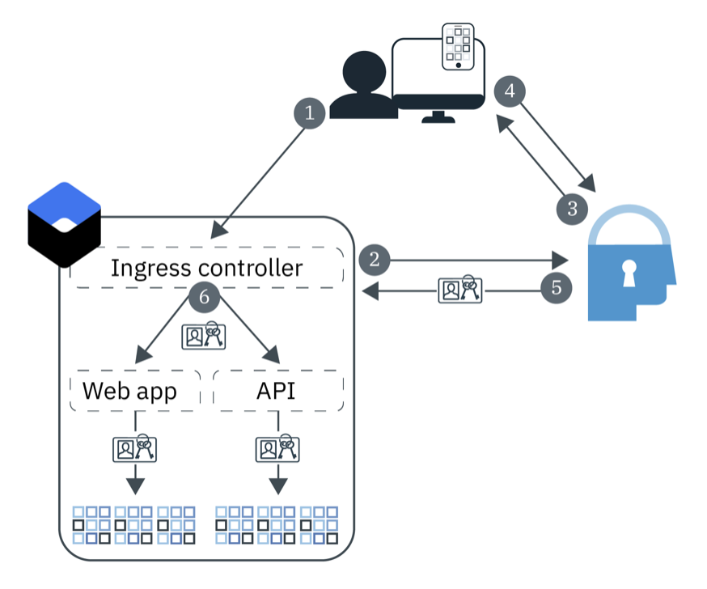

1. A user opens your application and triggers a request to the web app or API.

1. For the API flow, the Ingress controller attempts to validate the supplied tokens. If the web flow is used, it kicks off a three-leg OIDC authentication process.

1. App ID begins the authentication process by displaying the Login Widget.

1. The user provides a username or email and password.

1. The Ingress controller obtains access and identity tokens from App ID for authorization.

1. Every request that is validated and forwarded by the Ingress Controller to your apps has an authorization header that contains the tokens.

By binding your instance of App ID to your cluster, you can enforce protection for all of the apps that run in your cluster.

This repository includes a sample application and instructions that you can deploy the application to Kubernetes cluster in IBM Cloud and security it with App ID service.

The instructions were adapted and extended based on repo https://github.ibm.com/robobob/appid-sample.


## Step 1 - Provision the AppID Service and Add Users

To provision an App ID service,

1. Login to IBM Cloud (https://cloud.ibm.com).

1. Navigate to `App ID` service (https://cloud.ibm.com/catalog/services/app-id).

1. Select a `Region`. For example, `Dallas`.

1. Select a `pricing plan`. `Lite plan` provides 1000 monthly events and 1000 authorized users. For `Graduated tier` plan, the first 1000 authentication events and first 1000 authorized users are free each month. \

1. Assign a `Service name`. All lower case in the `Service name` is recommended for consistentcy between this name and `Secure` name in Kubernete cluster.

  > Note: Take a note of `Service name`. You'll need it soon.

1. Accept the the `resource group` or select a different one.

1. Click `Create`.


## Step 2 - Configure the AppID Service and Add Users

Once provisioned, initiate the service and enable the cloud directory.

1. Select `Manage Authentication` in the left pane.

1. Make sure `Cloud Directory` feature is enabled.

    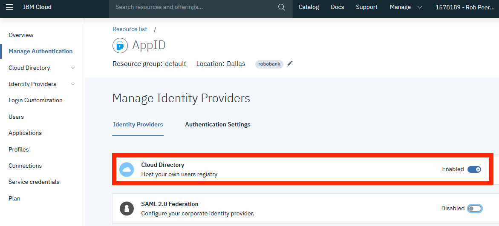

1. Expand `Cloud Directory` in the left pane.

1. Select `Users` in the left pane.

1. Click `Create User` button in the right window.

1. Enter 

    * `First Name`
    * `Last Name`
    * `Email`
    * `Password` twice

1. Click `Save`.

1. Add a few more users.

    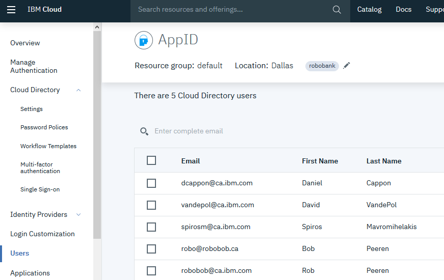


## Step 3 - Bind App ID Service to your Kubernetes cluster

This step is not strictly neccessary to secure the application. However, the sample application in this repo does make a call to the AppID service. Therefore, we need to pull the credentials of AppID service into the Kubernetes cluster:

1. Open a new terminal ort command window.

1. Login to the IBM Cloud. When prompted, enter user name and password. 

    ```sh
    $ ibmcloud login
    ```

1. List the clusters.

    ```sh
    $ ibmcloud ks clusters
    ```

1. Connect to your Kubernetes cluster.

    ```sh
    $ eval $(ibmcloud ks cluster-config --cluster <your K8S cluster> --export | tee -a ~/.bash_profile) 
    ```
    >If the command has a syntax error in your terminal (e.g. windows cmd shell), you may instead run the command `ibmcloud ks cluster-config --cluster <your K8S cluster>`. Then, copy the output and execute it in the same terminal.

1. You should be able to use kubectl command to list kubernetes resources. Try getting the list of pods (there should be none yet)

    ```sh
    $ kubectl get pods
 
    No resources found.
    ```

1. Login to the registry service.

    ```sh
    ibmcloud cr login
    ```

. Optionally, you may add a new `name space` in registry to store your docker image if you need one.

  	```
	  $ ibmcloud  cr  namespace-add  appid_[your initial]

  	$ export CRNAMESPACE=appid_[your initial]
	  ```

1. Bind App ID to your Kubernetes cluster.

    ```
    $ ibmcloud ks cluster-service-bind --cluster <your K8S cluster> --namespace default --service <AppIDServiceName>

    Binding service instance to namespace...
    OK
    Namespace:    default
    Secret name:  binding-appid
    ```
    
    Replace `<ClusterName>` with the name of the Kubernetes cluster where the application will run and replace `<AppIDServiceName>` with the name of your AppID service.

1. Verify the App ID binding. The command below should return a secret name `binding-<appidservicename>`.

    ```
    $ kubectl get secrets | grep binding

    binding-appid                  Opaque                                1      6d21h
    ```

1. Take note of your scret name for App ID binding. You'll need it soon. In the above example, it is `binding-appid`. Yours will be slightly different.

  
## Step 4 - Build your Container Image

You need to build a container image for your application before deploying it to your Kubernetes cluster.

1. Download this repo in your terminal window. You may also download the repo zipfile.

    ```
    $ git clone https://github.com/lee-zhg/intro-appid

    $ cd intro-appid
    ```

1. Build the docker image and store in your IBM Cloud image registry.

    ```
    $ ibmcloud cr build -t us.icr.io/<namespace>/appidsample:1 .
    ```
    
    Where `<namespace>` is one of your container registry namespaces (you many use a different registry location, depending on which region your registry is in).


## Step 5 - Deploy the application

In the `yaml` subdirectory of this repository, there is a deployment.yaml file.  Before you deploy the application with it, you will need to make two changes.

1. In the terminal window, go to the directory where this repo was downloaded.

1. Navigate to yaml/ subfolder.

1. Open file deployment.yaml in your favor file editor.

  * Replace `<registry name space>` with your registry name space.

  * Replace `<binding secret of appid service>` with your binding secret name.

  * Save the changes.

1. Deploy the sample application to your Kubernetes cluster.

    ```
    $ kubectl create -f ./deployment.yaml
    ```

1. Verify the deployment.

    ```
    $ kubectl get pods | grep appid

    appidsample-6c5c4f4d6f-vt42g                1/1     Running   0          32h
    ```


## Step 6 - Deploy the service

To create the required service for the sample application. No changes to the yaml file is necessary.

1. In the `yaml` subdirectory, execute the command below to create the service 

    ```
    $ kubectl create -f ./service.yaml
    ```

1. Verify the service. Two services should be created.

  * appidsample-secure
  * appidsample-insecure

    ```
    $ kubectl get services | grep appid

    appidsample-insecure            ClusterIP      172.21.39.185    <none>           3000/TCP                        41h
    appidsample-secure              ClusterIP      172.21.183.48    <none>           3000/TCP                        41h
    ```


## Step 7 - Determine hostname for your sample application

When deploying the `Ingress` of your Kubernetes cluster in the next section, you need `fully qualified hostname` where your sample application will run.

To determine the `hostname`,

1. Login to IBM Cloud.

1. Navigate to `https://cloud.ibm.com/kubernetes/clusters`.

1. Select your Kubernete cluster.

1. `Ingress subdomain` locates on the `Overview` tab.

    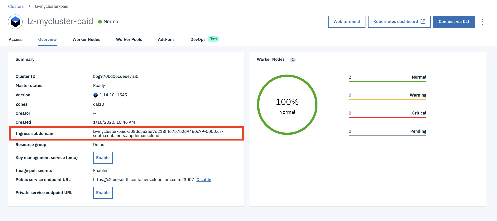

    > Note: `Ingress subdomain` can be very long. For example,  `lz-mycluster-paid-a08dc5e3ad7d218fff67b7b2d9460c79-0000.us-south.containers.appdomain.cloud`.

1. The `hostname` is the combination of string 

    * `appidsample.`
    * `Ingress subdomain`

    For example, `appidsample.lz-mycluster-paid-a08dc5e3ad7d218fff67b7b2d9460c79-0000.us-south.containers.appdomain.cloud`.


## Step 8 - Deploy the ingress

File `ingress.yaml` is provided in the `yaml` subdirectory. You can use the file to configure the `Ingress` of your Kubernetes cluster. The AppID ingress annotation will intercept all traffic heading to the `appidsample-secure` service, defined as path `/secure`.  All other traffic will be served by the `appidsample-insecure` service.  If you recall, you defined two services in the previous step.

You need to modify `ingress.yaml` file before deploying the `Ingress`.

1. Open `ingress.yaml` file in a file editor.

    ```
    apiVersion: extensions/v1beta1
    kind: Ingress
    metadata:
      name: appidsample
      annotations:
        ingress.bluemix.net/appid-auth: bindSecret=<binding-appid-secret> namespace=default requestType=web     serviceName=appidsample-secure
        ingress.bluemix.net/redirect-to-https: "True"
    spec:
      rules:
      - host: <hostname>
        http:
          paths:
          - backend:
              serviceName: appidsample-secure
              servicePort: 3000
            path: /secure
          - backend:
              serviceName: appidsample-insecure
              servicePort: 3000
            path: /
      tls:
      - hosts:
        - <hostname>
          secretName: appidsample
    ```

1. Replace `<binding-appid-secret>` with the secret name of your App ID binding. If you forgot writting down the secret name, run command `kubectl get secrets | grep binding` in terminal window.

1. Replace `<hostname>` with the hostname value that you identied in the previous step.

1. Save the changes.

1. Deploy the ingress.

    ```
    $ kubectl create -f ./ingress.yaml

    ingress.extensions/appidsample created
    ```

1. Verify the `Ingress` deployment.

    ```
    $ kubectl get ingress | grep appid

    appidsample        appidsample.clustername.us-east.containers.mybluemix.net    169.48.5.14   80, 443   41h
    ```


## Step 9 - Add the Callback URL to App ID Service

To secure your sample application with App ID service, you need to register your sample application with your App ID instance. You do this by adding a unique IKS URL to your App ID configuration.

1. Go back to your App ID service instance in IBM Cloud.

1. Navigate to `Manage Authentication` --> `Authentication Settings`.

    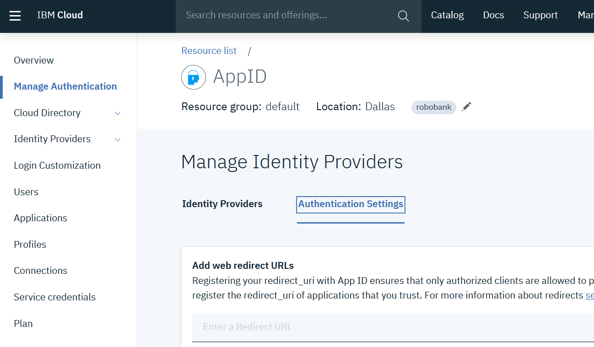

1. Your unique `Callback URL` is the combination of

    * String `https//`
    * `hostname` identified in the previous steps.
    * String `/secure/appid_callback`

    For example, `https://appidsample.lz-mycluster-paid-a08dc5e3ad7d218fff67b7b2d9460c79-0000.us-south.containers.appdomain.cloud/secure/appid_callback`.

1. Enter your `Callback URL` in the `Add web redirect URLs` field.

1. Click `+` icon at the end of the line.


## Step 10 - Test the sample application

Your sample application is deployed in your Kubernetes cluster in IBM Cloud and secured by your App ID service instance.

1. Access your sample application by entering `hostname` identified in previous steps in a browser. For example, `appidsample.lz-mycluster-paid-a08dc5e3ad7d218fff67b7b2d9460c79-0000.us-south.containers.appdomain.cloud`.

    > Note: You can't test this sample application in `Chrome` browser.

1. The sample application home page is loaded. There is a `Login` button at the top-right corner.

    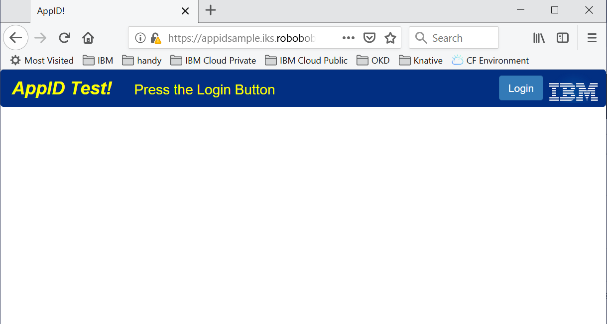

1. Click the `Login` button, you should be redirected to the AppID login page.  

    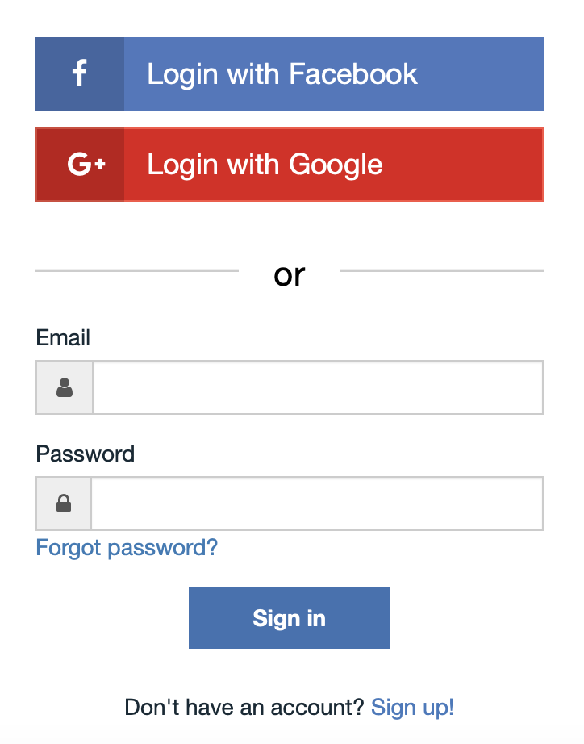

1. After providing your credentials, you should be redirected back to the application, with your user information from AppID dumped to the screen.

    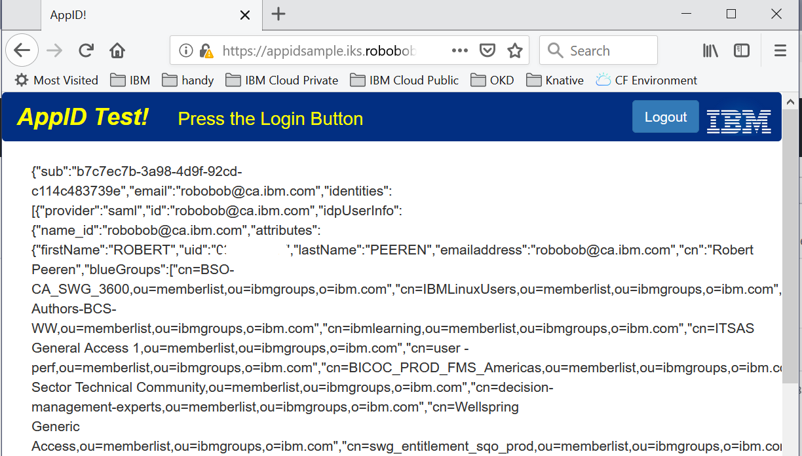

1. Pressing the `Logout` button will log you out of the service.


## Additioal Notes on the Source Code

If you take a look at the server code, you will see that all secure operations hang off the `/secure` URL:

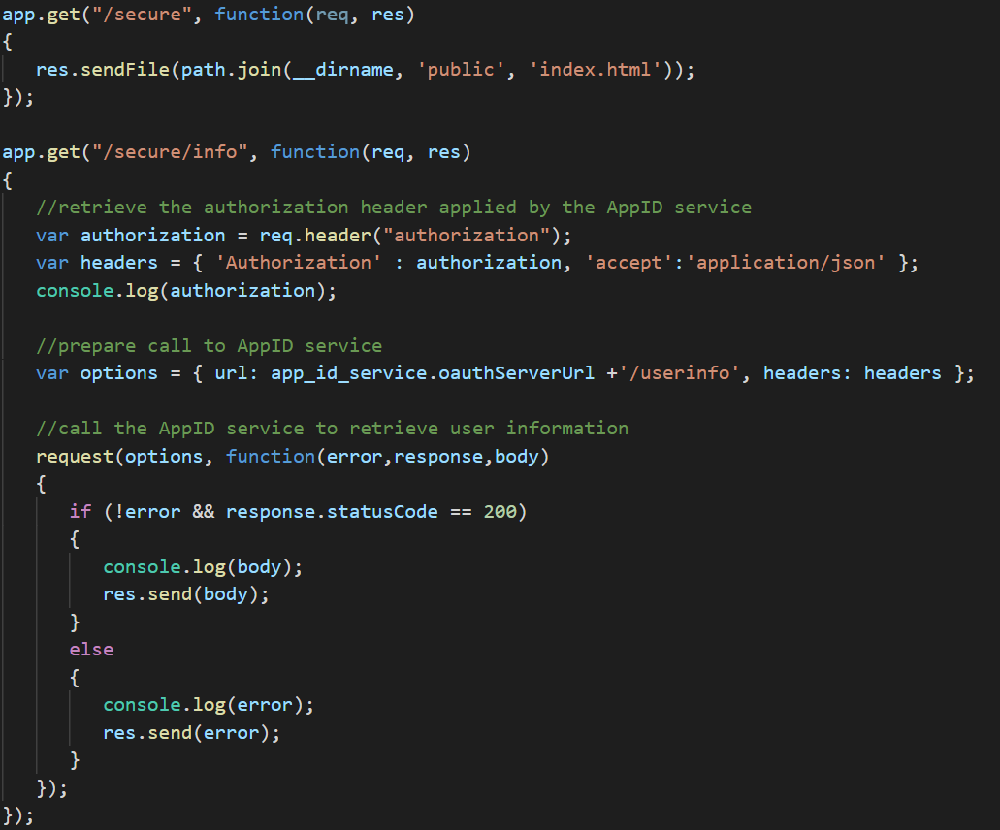

Everything hanging off `/secure` will be intercepted by AppID and checked to see if you are logged in and have access to the service.  The resulting call on the server side will contain an `Authorization` header in the request bearing the identity token of the logged in user.  The above sample code uses that token to retreive the client details from AppID.

To log out, IKS also supports an AppID logout URL. However, it always forces a redirect back to the AppID login page.  To avoid this, I added a server side logout function to remove the AppID cookies from the browser:

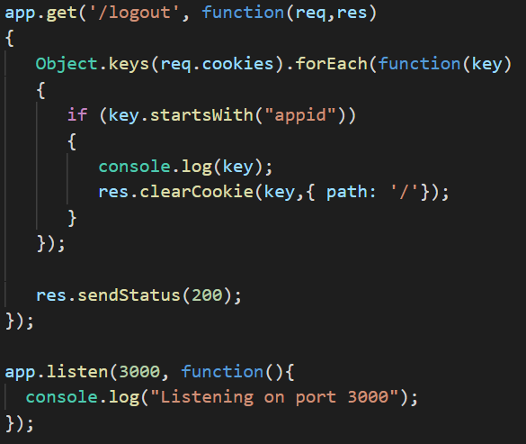

On the client side, the Javascript to perform logout looks like this:

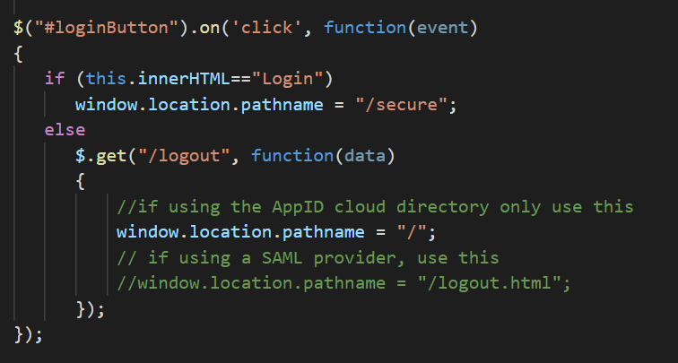

Note the code comments.  If you have just enabled cloud directory, then you are fine.  However, if you have enabled a SAML provider and want to ensure your credentials are cleared there as well, you need to redirect the browser to the supplied `logout.html`.

This file uses a hidden frame to call the SAML provider secretly to remove your credentials:

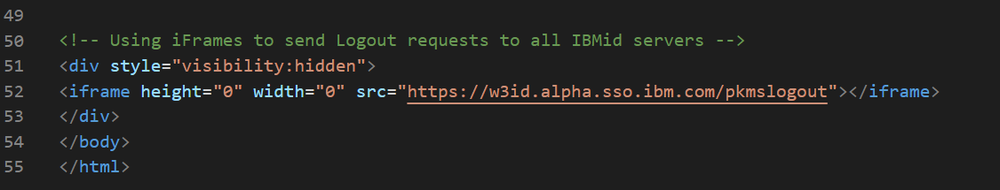

You will need to change the URL on line 52 to the correct URL for your SAML provider.  The IBM SAML providers can be found here:

https://appid-iks-federated-logout.antona.us-south.containers.appdomain.cloud/test

Good hunting!


